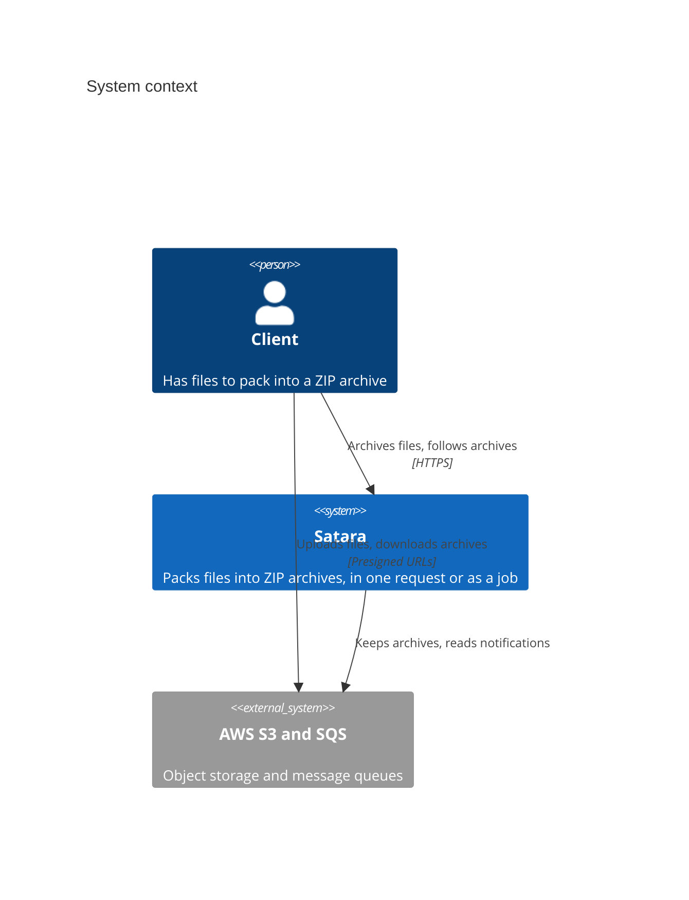
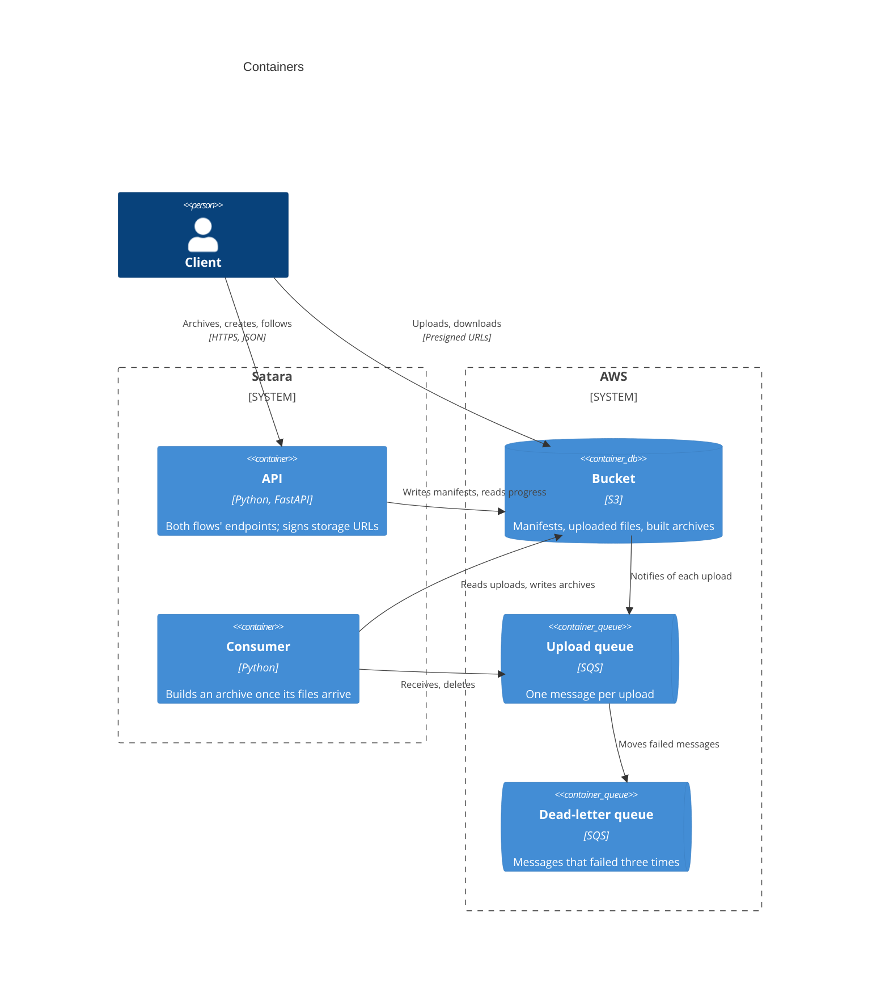
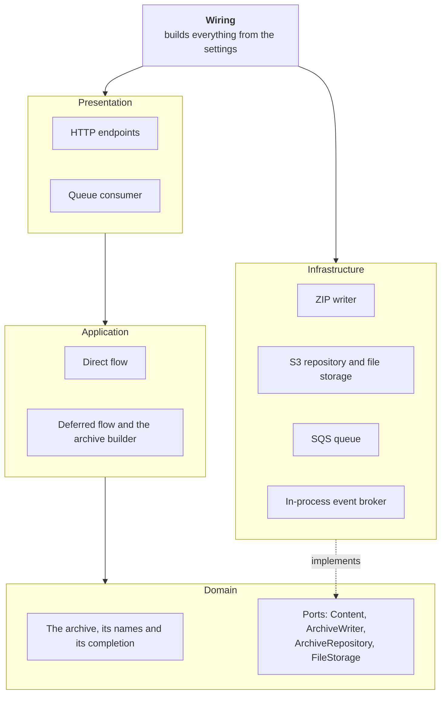
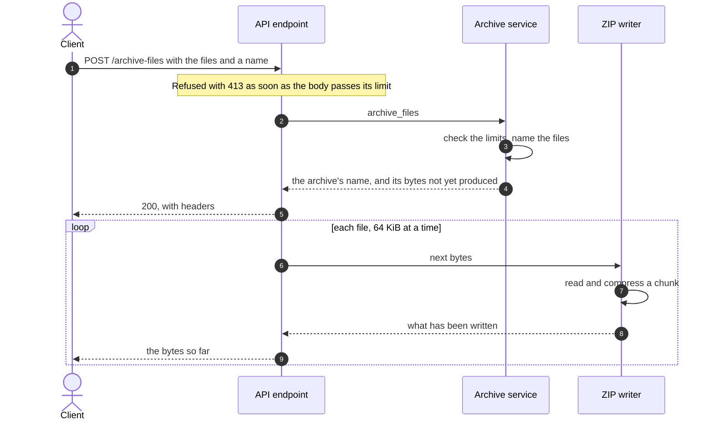
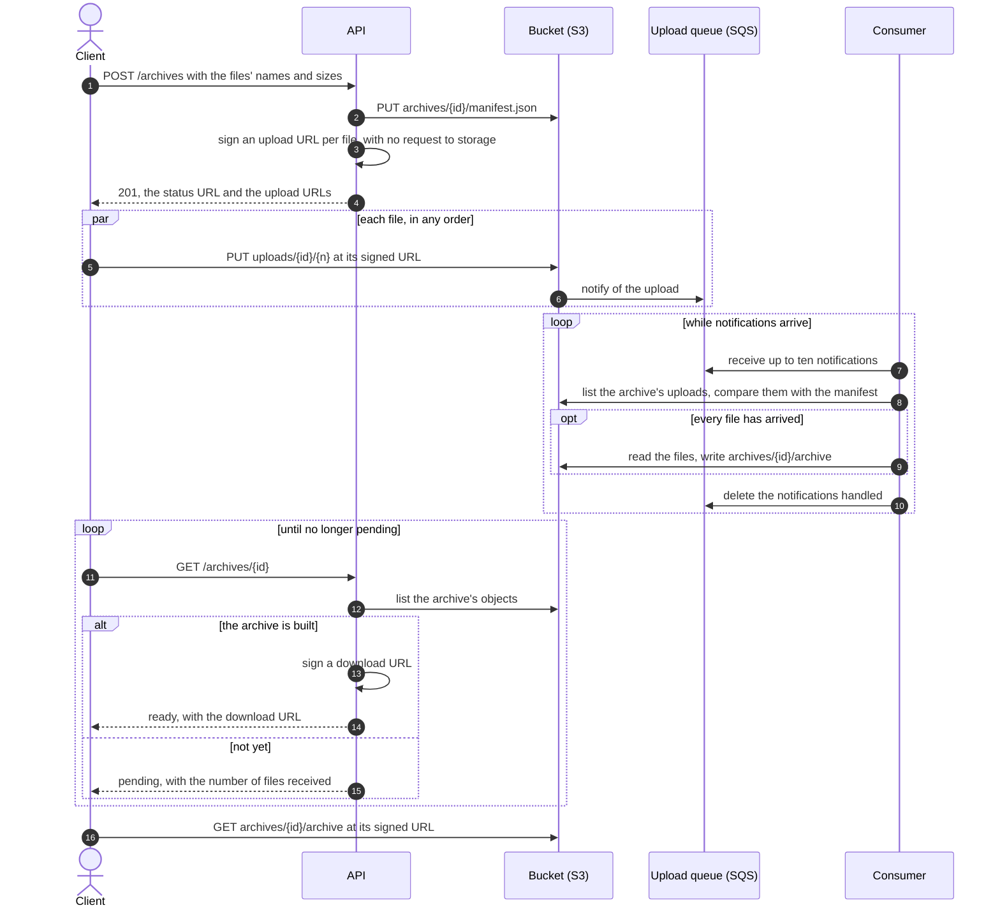

# Architecture

## The system

A client archives files with the service, and in the deferred flow also talks to storage
directly, through URLs the service signs for it. The service runs on AWS's storage and queues,
or on anything that speaks their protocols, such as the emulator in the local stack.

Inside it, two processes run from one image: the API, which serves both flows, and the consumer,
which builds deferred archives. The direct flow needs only the API.

## Layers

The code in `satara/` is split into layers, each a single module until it outgrows one and
becomes a package. A layer depends only on the ones above it in this list.

| Layer          | Module            | Holds                                                                                      |
|----------------|-------------------|--------------------------------------------------------------------------------------------|
| Domain         | `domain.py`       | The archive, the rules for its names and its completion, and the ports.                    |
| Application    | `application/`    | The use cases of each flow, the limits they share, and the handler that builds an archive. |
| Infrastructure | `infrastructure/` | The ZIP writer, the S3 repository and file storage, and an in-process event broker.        |
| Presentation   | `presentation/`   | The HTTP endpoints, the answers to refused requests, and the queue consumer.               |
| Wiring         | `wiring.py`       | Builds the application, the deferred flow's service and the consumer from the settings.    |

The arrows point the way dependencies do: no layer knows of a layer that depends on it. The SQS
queue and the event broker implement protocols in `common/`, `MessageQueue` and `EventBroker`,
rather than the domain's ports, as neither speaks of archives.

Settings are read in `config.py`, and `scripts/consumer.py` starts the consumer the way the
server starts the application. `common/` holds generic utilities with no project vocabulary:
the base models, domain events and their broker port, logging and the heartbeat.

One archive entity serves both flows. In the direct flow its files' content is there from the
start; in the deferred flow it arrives later, and the archive tracks which files have arrived
and whether it is built.

## Ports

The domain declares the protocols that the rest of the code meets:

- `Content` is the bytes of a file, read in chunks. An uploaded file meets it directly; in the
  deferred flow it reads a stored file only when first read; the tests use an in-memory one.
- `ArchiveWriter` writes an archive in one format, producing its bytes as they are ready. It
  also names the format's media type and file suffix, which the response headers use.
- `ArchiveRepository` keeps archives: their names, their files, and how far each has got.
- `FileStorage` keeps the files' content and the built archives, and hands out URLs to upload
  and download them.

`EventBroker`, in `common/`, delivers the events an archive records to their handlers.

The application depends only on these, never on ZIP or S3. Another archive format would be a
second implementation of `ArchiveWriter`; a database could keep archives in place of the
bucket's manifests by implementing `ArchiveRepository` alone.

## A direct request, end to end

1. **The body size guard**, Starlette's request body limit middleware, refuses a body larger
   than the total size limit as it arrives, before the form parser stores it.
2. **The form parser** reads the files, writing any larger than 1 MiB to temporary files.
3. **The endpoint** turns each upload into an `UploadedFile` and calls `archive_files`.
4. **The service** checks the number of files and the size of each, keeps each file's base
   name, and adds the files to an `Archive`, which renames any whose name is taken. It reads no
   content: it returns the writer's output unread, so every check is complete before the
   response starts.
5. **The response** streams the writer's output. The ZIP writer reads each file in 64 KiB
   chunks and compresses each chunk in a worker thread, so compression does not hold up other
   requests, and sends what it has written after each chunk.

A refusal from the service is raised as an exception and answered by one handler in the
presentation layer, which picks the status: 413 for a broken limit, 422 for anything else.

## A deferred archive, end to end

1. **The endpoint** calls `create_archive`, which checks the declared files against the
   deferred limits and names them as the direct flow does. The repository writes the archive's
   manifest to `archives/<id>/manifest.json`, and the answer carries a presigned upload URL for
   each file, signed for its exact size.
2. **The client** uploads each file to `uploads/<id>/<n>`. The service takes no part: storage
   checks each upload against its URL.
3. **The bucket** notifies the queue of each upload.
4. **The consumer** receives up to ten messages at a time, groups them by archive, and calls
   `check_uploads` once per archive. That loads the archive, which compares the files in the
   bucket with its manifest and records `AllFilesReceived` once every file is there and it is
   not built. The service publishes the event through the broker.
5. **The archive builder** handles the event: it writes the ZIP, reading each file from the
   bucket as it goes, and stores it at `archives/<id>/archive` with a multipart upload.
6. **The status endpoint** finds the built archive and answers with a download URL, which
   names the file through the response's `Content-Disposition` header.

Each message only prompts a check, so messages for one archive are interchangeable: whichever
check first finds every file there triggers the build, and every later one is deleted without
work. The consumer handles one batch at a time, so a message for an archive being built is
read only after the build. A failed check leaves its messages to be delivered again; on a
message's last attempt the consumer marks the archive failed, and the queue then moves the
message to its dead-letter queue.

The consumer is the service's own code rather than a library or a platform's function, which
keeps it deployable as a container anywhere. The webhook that many S3-compatible stores send
in place of a queue notification was weighed and set aside: an endpoint must answer within
seconds, so a build would run after the answer, and a restart during it would lose it with
nothing to start it again. [DECISIONS.md](https://github.com/berislavlopac/satara/blob/main/DECISIONS.md)
records the reasoning in full.

## Tests

The tests in `tests/unit/` cover each layer through its public surface, from the domain's naming
rules, partly with generated inputs, to the whole application driven through the test client
with the real ZIP writer. The deferred flow's use cases, endpoints and consumer run against
in-memory doubles of the repository, file storage, broker and queue. The S3 and SQS adapters
run against moto, an AWS emulator started inside the test process, so the unit tests need no
Docker and cover every module.

The tests in `tests/integration/` are a further layer, run against the local Compose stack with
`just test-integration`. They show what only a full emulator can: storage enforcing a presigned
upload's size, a download served under its name, and an archive taken through the whole
deferred flow, from creating it to downloading the built ZIP.

They are written to be read as well as run: a test's name reads as a sentence describing the
behaviour, and its body shows how the code is used. The test doubles live in
`tests/unit/fakes.py` and reach the tests through fixtures. They are the only test code that is
type-checked, each one built on the protocol it stands in for, so that it cannot drift from it.
